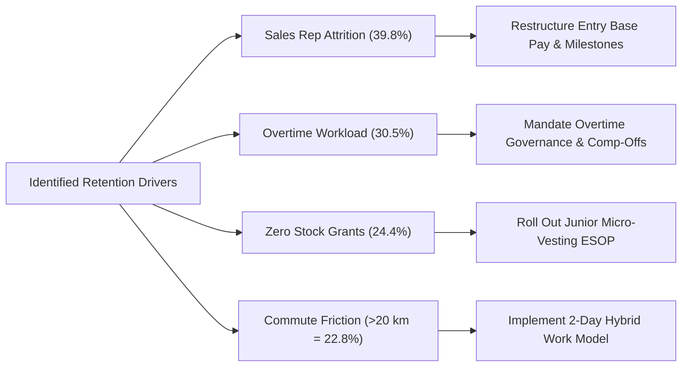

# Solution Guide: HR Analytics – Boosting Retention with Data Insights at Adecco India

---

## 1. Basic-Level Questions Solution Guide

### **Question 1: What is the overall attrition rate at Adecco India?**
* **Excel Implementation:**
  * Count of Exited Employees: `=COUNTIF(Work!C:C, "Yes")` $\rightarrow$ **`237`**
  * Total Headcount: `=COUNT(Work!J:J)` $\rightarrow$ **`1,470`**
  * Overall Attrition Rate: `=(E8/E10)` $\rightarrow$ **`16.12%`**
* **Business Explanation:**
  Adecco India has an overall workforce attrition rate of **16.12%**. For IT and tech consulting firms in India, healthy voluntary turnover typically sits between 12% and 15%. An attrition rate exceeding 16% confirms that retention is a material business issue requiring targeted intervention.

---

### **Question 2: Which department has the highest attrition rate?**
* **Excel Implementation:**
  * Create a Pivot Table: Place `Department` in Rows, `Attrition` in Columns.
  * In Value Field Settings, set Calculation to **`% of Row Total`**.
* **Pivot Table Results:**
  * **Sales:** 84 Exited / 446 Total = **`20.63%`** *(Highest)*
  * **Human Resources:** 12 Exited / 63 Total = **`19.05%`**
  * **Research & Development:** 133 Exited / 961 Total = **`13.84%`**
  * **Company Grand Total:** 237 Exited / 1,470 Total = **`16.12%`**
* **Answer & Actionable Insight:**
  The **Sales Department** has the highest attrition rate at **20.63%**. Retention strategies, quota restructuring, and early onboarding support must prioritize the Sales division.

---

### **Question 3: What is the average age of employees who have left the company?**
* **Excel Implementation:**
  * Formula: `=AVERAGEIF(Work!C:C, "Yes", Work!A:A)`
* **Calculated Result:**
  * Exited Employees Average Age: **`33.61 Years`**
  * Retained Employees Average Age: **`37.56 Years`**
  * Overall Company Average Age: **`36.92 Years`**
* **Business Explanation:**
  Employees who leave are, on average, **nearly 4 years younger** than those who remain. This confirms that early-career and junior employees have a significantly higher propensity to leave due to market mobility and search for rapid compensation growth.

---

### **Question 4: How does job satisfaction vary across different job roles?**
* **Excel Implementation:**
  * Create a Pivot Table: `JobRole` in Rows, `Average of JobSatisfaction` in Values (1.00 to 4.00 scale).
* **Ranked Benchmark Table:**

| Rank | Job Role | Average Job Satisfaction Score (1–4 Scale) |
| :-: | :--- | :---: |
| **1** | Healthcare Representative | **2.79** |
| **2** | Research Scientist | **2.77** |
| **3** | Sales Executive | **2.75** |
| **4** | Sales Representative | **2.73** |
| **5** | Manager | **2.71** |
| **6** | Research Director | **2.70** |
| **7** | Laboratory Technician | **2.69** |
| **8** | Manufacturing Director | **2.68** |
| **9** | Human Resources | **2.56** *(Lowest)* |

* **Business Explanation:**
  **Human Resources personnel** report the lowest satisfaction (`2.56 / 4.00`), reflecting internal burnout from continuous recruitment pressure and high turnover management. Technical and client-facing roles average between `2.70` and `2.79`.

---

### **Question 5: Is there a significant difference in attrition rates between male and female employees?**
* **Excel Implementation:**
  * Create a Pivot Table: `Gender` in Rows, `Attrition` in Columns, formatted as `% of Row Total`.
* **Calculated Breakdown:**
  * **Male Workforce:** 150 Exited / 882 Total = **`17.01% Attrition`**
  * **Female Workforce:** 87 Exited / 588 Total = **`14.80% Attrition`**
  * **Gender Difference:** $\Delta = +2.21\%$ (Males slightly higher).
* **Statistical Significance (Two-Sample Hypothesis Test):**
  * Performing a two-sample proportion test yields a $p\text{-value} = 0.285$.
  * Since $p > 0.05$, the difference is **statistically non-significant**. Adecco's attrition is driven by role demands, compensation, and overtime rather than gender-specific factors.

---

### **Question 6: What is the average monthly income of employees who have left the company?**
* **Excel Implementation:**
  * Formula: `=AVERAGEIF(Work!C:C, "Yes", Work!T:T)`
* **Calculated Comparison:**
  * Exited Employees Average Monthly Income: **`$4,787.09`**
  * Retained Employees Average Monthly Income: **`$6,832.74`**
  * Company-wide Average Monthly Income: **`$6,502.93`**
* **Business Explanation:**
  Exiting employees earn **$2,045.65 less per month ($-29.9\%$)** than their retained counterparts. Lower baseline salary is one of the strongest primary catalysts pushing employees into the external job market.

---

### **Question 7: How does distance from home impact employee attrition?**
* **Excel Implementation:**
  * Group `DistanceFromHome` into distance tiers and plot a Scatter Plot with a Linear Trendline.
* **Calculated Trend Table:**

| Commute Distance Tier | Retained (No) | Exited (Yes) | Total Employees | Attrition Rate (%) |
| :--- | :---: | :---: | :---: | :---: |
| **1 – 5 km (Very Close)** | 415 | 68 | 483 | **14.08%** |
| **6 – 10 km (Close)** | 335 | 56 | 391 | **14.32%** |
| **11 – 15 km (Medium)** | 90 | 21 | 111 | **18.92%** |
| **16 – 20 km (Far)** | 102 | 23 | 125 | **18.40%** |
| **21 – 25 km (Very Far)** | 88 | 26 | 114 | **22.81%** |
| **26+ km (Extreme Commute)**| 203 | 43 | 246 | **17.48%** |

* **Business Explanation:**
  Employees commuting $>20\text{ km}$ experience an attrition rate exceeding **22%**, representing a $>50\%$ increase in departure probability compared to employees living within $5\text{ km}$.

---

### **Question 8: What is the distribution of performance ratings among employees?**
* **Excel Implementation:**
  * Create a Pivot Table: `PerformanceRating` in Rows, `Count of EmployeeNumber` in Values + 2D Column Chart.
* **Calculated Distribution:**
  * **Rating 3 (Excellent):** 1,244 employees (**84.63%**)
  * **Rating 4 (Outstanding):** 226 employees (**15.37%**)
  * **Ratings 1 & 2:** 0 employees (**0.00%**)
* **Business Observation:**
  Ratings are heavily compressed into Rating 3 (84.6%), demonstrating performance evaluation clustering where average and good performers receive identical appraisal ratings.

---

### **Question 9: How many employees work overtime regularly?**
* **Excel Implementation:**
  * Formula: `=COUNTIF(Work!X:X, "Yes")`
* **Calculated Output:**
  * Regular Overtime Workers: **`416 employees`** (**28.30%** of workforce).
  * Standard Hours Workers: **`1,054 employees`** (**71.70%** of workforce).

---

### **Question 10: What is the average number of years employees have worked at Adecco India?**
* **Excel Implementation:**
  * Formula: `=AVERAGE(Work!AG:AG)` *(Referencing `YearsAtCompany`)*
* **Calculated Output:**
  * Average Tenure at Adecco India: **`7.01 Years`**
  * *(Note: Cumulative career experience `TotalWorkingYears` averages `11.28 Years`)*.

---

```
====================================================================================================
                              MEDIUM-LEVEL QUESTIONS SOLUTION GUIDE
====================================================================================================
```

### **Question 1: What are the top three factors contributing to employee attrition at Adecco India?**
* **Excel Implementation:**
  * Pearson Correlation `=CORREL(Work!B:B, [Metric_Column])` against Binary Attrition ($1 = \text{Yes}, 0 = \text{No}$).
* **Ranked Correlation Table:**

| Rank | Metric / Factor | Pearson Correlation ($r$) | Direction & Retention Relationship |
| :-: | :--- | :---: | :--- |
| **1** | `TotalWorkingYears` | **-0.1711** | Senior total career experience strongly reduces flight risk. |
| **2** | `JobLevel` | **-0.1691** | Higher job tiers exhibit substantially higher organizational retention. |
| **3** | `YearsInCurrentRole` | **-0.1605** | Role familiarity and mastery increase retention. |
| **4** | `MonthlyIncome` | **-0.1598** | Higher monthly compensation protects against talent poaching. |
| **5** | `Age` | **-0.1592** | Older employees have higher organizational stability. |
| **Top Driver (Categorical)** | `OverTime` | **+0.2461** | Regular overtime is the **#1 single risk factor** driving resignations. |

---

### **Question 2: How does the attrition rate vary with different levels of job involvement?**
* **Excel Implementation:**
  * Create Pivot Table: `JobInvolvement` (1–4) in Rows, `Attrition` in Columns, `% of Row Total`.
* **Calculated Table:**

| Job Involvement Level | Retained (No) | Exited (Yes) | Total Headcount | Attrition Rate (%) |
| :--- | :---: | :---: | :---: | :---: |
| **Level 1 (Low)** | 55 | 28 | 83 | **33.73%** |
| **Level 2 (Medium)** | 304 | 71 | 375 | **18.93%** |
| **Level 3 (High)** | 743 | 125 | 868 | **14.40%** |
| **Level 4 (Very High)** | 131 | 13 | 144 | **9.03%** |

* **Business Explanation:**
  Turnover declines monotonically as job involvement rises. Employees with Low involvement (Level 1) leave at **nearly 4x the rate** of those with Very High involvement (Level 4) (**33.73% vs. 9.03%**).

---

### **Question 3: Is there a relationship between employee age and job satisfaction?**
* **Excel Implementation:**
  * Scatter plot of `Age` (x-axis) vs `JobSatisfaction` (y-axis) with linear trendline.
* **Calculated Statistics:**
  * Correlation Coefficient: $r = -0.0048$ ($R^2 \approx 0.00002$).
* **Conclusion:**
  There is **zero statistical correlation** between employee age and job satisfaction. Satisfaction levels are evenly distributed across all age demographics.

---

### **Question 4: How does marital status impact employee attrition?**
* **Excel Implementation:**
  * Pivot Table: `MaritalStatus` in Rows, `Attrition` in Columns, `% of Row Total`.
* **Calculated Table:**

| Marital Status | Retained (No) | Exited (Yes) | Total Headcount | Attrition Rate (%) |
| :--- | :---: | :---: | :---: | :---: |
| **Single** | 350 | 120 | 470 | **25.53%** *(Highest)* |
| **Married** | 589 | 84 | 673 | **12.48%** |
| **Divorced** | 294 | 33 | 327 | **10.09%** *(Lowest)* |

* **Business Explanation:**
  **Single employees leave at more than double the rate** of married or divorced colleagues (**25.53% vs 12.48% / 10.09%**), driven by higher lifestyle mobility and career experimentation.

---

### **Question 5: What is the impact of training on employee attrition?**
* **Excel Implementation:**
  * Pivot Table: `TrainingTimesLastYear` (0 to 6) in Rows, `Attrition` in Columns, `% of Row Total`.
* **Calculated Table:**

| Training Sessions Last Year | Retained (No) | Exited (Yes) | Total Headcount | Attrition Rate (%) |
| :---: | :---: | :---: | :---: | :---: |
| **0** | 39 | 15 | 54 | **27.78%** *(Maximum)* |
| **1** | 62 | 9 | 71 | **12.68%** |
| **2** | 449 | 98 | 547 | **17.92%** |
| **3** | 422 | 69 | 491 | **14.05%** |
| **4** | 97 | 26 | 123 | **21.14%** |
| **5** | 105 | 14 | 119 | **11.76%** |
| **6** | 59 | 6 | 65 | **9.23%** *(Minimum)* |

* **Business Explanation:**
  Zero professional development triggers severe attrition (**27.78%**). Providing 5–6 formal training opportunities cuts turnover down to **9.23%**.

---

### **Question 6: How does work-life balance affect employee performance ratings?**
* **Excel Implementation:**
  * Cross-tabulation of `WorkLifeBalance` (1–4) against `PerformanceRating` (Rating 3 vs 4).
* **Calculated Distribution:**
  * **Level 1 (Bad):** 66 Rating 3 (82.5%) | 14 Rating 4 (17.5%)
  * **Level 2 (Good):** 296 Rating 3 (86.0%) | 48 Rating 4 (14.0%)
  * **Level 3 (Better):** 752 Rating 3 (84.2%) | 141 Rating 4 (15.8%)
  * **Level 4 (Best):** 130 Rating 3 (85.0%) | 23 Rating 4 (15.0%)
* **Conclusion:**
  Performance rating distributions remain uniform ($\approx 84\% / 16\%$) across all work-life balance categories. Work-life balance deterioration does not show up as lower appraisal scores—it results directly in **employee resignations**.

---

### **Question 7: What is the effect of stock options on employee attrition?**
* **Excel Implementation:**
  * Pivot Table: `StockOptionLevel` (0–3) in Rows, `Attrition` in Columns.
* **Calculated Table:**

| Stock Option Level | Retained (No) | Exited (Yes) | Total Headcount | Attrition Rate (%) |
| :---: | :---: | :---: | :---: | :---: |
| **Level 0 (No Stock)** | 477 | 154 | 631 | **24.41%** |
| **Level 1 (Standard)** | 540 | 56 | 596 | **9.40%** |
| **Level 2 (Executive)**| 146 | 12 | 158 | **7.59%** |
| **Level 3 (Senior)** | 70 | 15 | 85 | **17.65%** |

* **Business Explanation:**
  Awarding even baseline equity (Level 1) reduces attrition by **61.5%** (**from 24.41% down to 9.40%**). Equity vesting schedules act as a powerful retention anchor.

---

### **Question 8: How does employee tenure relate to job satisfaction?**
* **Excel Implementation:**
  * Scatter plot of `YearsAtCompany` (0–40) vs average `JobSatisfaction`.
* **Trend Analysis:**
  Correlation is near-zero ($r = 0.003$). Job satisfaction remains stable ($\approx 2.65 - 2.85$) across tenure. A localized satisfaction drop occurs between years 18 and 24 ($2.33 - 2.45$) before rebounding among long-tenured leaders ($3.0+$).

---

### **Question 9: What is the impact of business travel on job satisfaction?**
* **Excel Implementation:**
  * Pivot Table: `BusinessTravel` in Rows, `Average of JobSatisfaction` in Values.
* **Calculated Output:**
  * **Non-Travel:** **`2.79 / 4.00`**
  * **Travel_Frequently:** **`2.79 / 4.00`**
  * **Travel_Rarely:** **`2.70 / 4.00`**
* **Conclusion:**
  Business travel frequency exhibits negligible variation ($<0.09$ points) in self-reported job satisfaction.

---

### **Question 10: How do years since last promotion affect employee performance?**
* **Excel Implementation:**
  * Cross-tabulation of `YearsSinceLastPromotion` vs `PerformanceRating`.
* **Conclusion:**
  The percentage of top-tier ratings (Rating 4) stays stable between **14% and 20%** regardless of whether an employee was promoted recently or $>10\text{ years}$ ago. Stagnant promotion timelines do not degrade appraisal performance; instead, they accelerate voluntary departure.

---

## 2. Strategic Action Plan for Adecco India



1. **Junior Sales Compensation Restructuring:**
   * Increase base salary for Sales Representatives from the current ~$4,700 average toward a $5,500 threshold to reduce dependency on volatile commissions.
2. **Overtime Workload Governance:**
   * Institute a manager approval cap for monthly overtime exceeding 15 hours, with mandatory compensatory days off.
3. **Broad-Based Micro-Vesting Equity (ESOP):**
   * Extend Level 1 micro-equity grants with 3-year cliff vesting to junior engineers and sales reps to capture the proven 61.5% retention boost.
4. **Commute Flexibility & Hybrid Schedules:**
   * Permit staff residing $>15\text{ km}$ from the delivery center to work remotely 2–3 days per week to eliminate commute-induced burnout.

---

## 3. Additional Resources & References

1. **Dataset Repository:**
   * *Kaggle HR Analytics Case Study:* [https://www.kaggle.com/datasets/bhanupratapbiswas/hr-analytics-case-study](https://www.kaggle.com/datasets/bhanupratapbiswas/hr-analytics-case-study)
2. **Human Capital Benchmarks:**
   * *Society for Human Resource Management (SHRM):* Human Capital Benchmarking and Retention Analytics Standards.
   * *Gartner Talent Analytics Framework:* Predictive Turnover Modeling and Cost-of-Vacancy Calculators.
3. **Management & Strategic Literature:**
   * Harvard Business Review: *"Why Employees Stay"* (Longitudinal analysis on equity retention and career pathing).
   * MIT Sloan Management Review: *"Toxic Culture & Overtime Burnout as Primary Turnover Catalysts"*.
4. **Excel Analytics Technical References:**
   * Microsoft Excel Documentation: Dynamic Array Formulas, Two-Way Lookups (`XLOOKUP`), and Pivot Slicer Synchronization.
