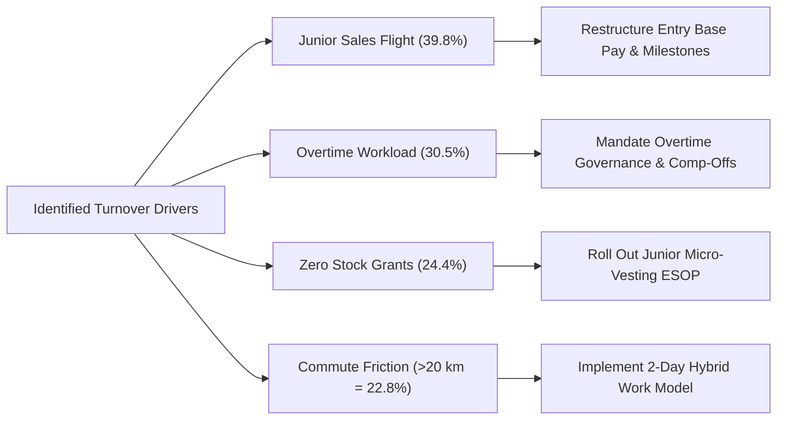

# HR Analytics: Boosting Retention with Data Insights (Adecco India)

---

## Project Overview

This repository presents an end-to-end HR Analytics case study analyzing workforce attrition dynamics at **Adecco India**, an IT consulting and technology enterprise.

Using enterprise workforce data across **1,470 employee records** and **35 attributes**, this project identifies primary voluntary turnover catalysts, evaluates department- and role-level attrition risks, and delivers an executive-level strategic retention framework.

---

## Business Problem

Adecco India faces an overall attrition rate of **16.12%** (surpassing the industry benchmark of 12%–15%), with a sharp departure spike among **junior-level employees in Sales**.

### Core Business Impacts:
* **Replacement Costs:** Replacing departed staff costs **$1.5\times$ to $2\times$** an employee's annual salary in recruitment, onboarding, and training.
* **Pipeline Disruption:** Sales rep turnover directly impairs quota attainment, client onboarding velocity, and revenue goals.
* **Workforce Burnout:** Departure cascades increase workload stress on retained personnel, triggering secondary attrition waves.

---

## Dataset Summary

The dataset consolidates information across **1,470 employees** across four core internal systems (HRIS, PMS, Engagement Surveys, and Exit Interviews) spanning **35 attributes**:

* **Demographics & Profile:** Age, Gender, Marital Status, Education, Education Field, Distance From Home.
* **Organizational Structure:** Department, Job Role, Job Level, Standard Hours, Employee Number.
* **Compensation & Benefits:** Monthly Income, Daily Rate, Hourly Rate, Monthly Rate, Percent Salary Hike, Stock Option Level.
* **Tenure & Work Experience:** Total Working Years, Years at Company, Years in Current Role, Years Since Last Promotion, Years with Current Manager, Number of Companies Worked.
* **Workload & Performance:** Overtime (Yes/No), Business Travel, Performance Rating, Training Times Last Year.
* **Employee Sentiment (1–4 Scale):** Job Satisfaction, Environment Satisfaction, Relationship Satisfaction, Job Involvement, Work-Life Balance.

---

## Key Findings & Analytical Insights

### 1. Department & Role Disparities
* **Sales Department** suffers the highest turnover at **20.63%**, followed by **Human Resources (19.05%)** and **R&D (13.84%)**.
* **Sales Representatives** experience severe early-career turnover (~39.8%).
* **HR personnel** report the lowest job satisfaction across all roles (**2.56 / 4.00**), reflecting high recruitment stress and turnover management fatigue.

### 2. Primary Flight Drivers (Correlation Analysis)
* **Overtime Workload ($r = +0.2461$):** Regular overtime is the **#1 overall flight risk**. Employees working regular overtime experience significantly elevated turnover (~30.5%).
* **Career Experience ($r = -0.1711$):** Junior employees leave at substantially higher rates; departing staff average **33.61 years of age** vs. **37.56 years** for retained staff.
* **Hierarchical Job Level ($r = -0.1691$):** Entry and junior levels face the highest risk of resignation.
* **Monthly Compensation ($r = -0.1598$):** Departing employees earn **\$2,045.65 less per month (-29.9%)** on average compared to retained colleagues (\$4,787 vs. \$6,833).

### 3. Equity & Long-Term Retention
* Employees with **no stock options (Level 0)** experience **24.41% attrition**.
* Awarding standard baseline equity (**Level 1**) cuts attrition to **9.40%**—a **61.5% turnover reduction**.

### 4. Commute Friction & Training Engagement
* **Commute Impact:** Staff commuting $>20\text{ km}$ face an attrition rate of **22.81%** (a $>50\%$ increase over employees living within $5\text{ km}$ at 14.08%).
* **Training & Enablement:** Zero training sessions in a year leads to **27.78% attrition**, whereas 5–6 formal training sessions reduces turnover to **9.23%**.

### 5. Non-Drivers (Dispelling Assumptions)
* **Gender Difference:** Males (17.01%) vs. Females (14.80%) yields $p = 0.285$, confirming the difference is **statistically non-significant**.
* **Age vs. Satisfaction:** Near-zero correlation ($r = -0.0048$); satisfaction remains evenly distributed across age demographics.
* **Appraisal Compression:** 84.6% of staff receive identical appraisal ratings (Rating 3), showing that performance rating systems do not reflect disengagement prior to departure.

---

## Strategic Retention Action Plan

### Core Action Pillars:
1. **Junior Sales Compensation Restructuring:**
   * Raise baseline salary for junior Sales Representatives from ~\$4,700 toward a \$5,500 threshold to reduce dependency on volatile variable commission.
2. **Overtime Workload Governance:**
   * Enforce a managerial approval threshold for overtime exceeding 15 hours/month, accompanied by mandatory compensatory time-off (comp-offs).
3. **Broad-Based Micro-Vesting Equity (ESOP):**
   * Expand Level 1 micro-equity grants with 3-year cliff vesting to junior technical and sales contributors to unlock the proven 61.5% retention benefit.
4. **Hybrid Commute Policy:**
   * Institute a flexible 2-day remote schedule for employees residing $>15\text{ km}$ from delivery centers to eliminate daily transit fatigue.

---

## Analysis Methodology & Tools

* **Exploratory Data Analysis (EDA):** Descriptive statistics, frequency distributions, and demographic segmentation.
* **Comparative Cross-Tabulations:** Pivot tables evaluating categorical interactions (% of row totals).
* **Correlation Modeling:** Pearson correlation coefficients ($r$) mapping continuous/ordinal features to binary attrition.
* **Hypothesis Testing:** Two-sample proportion hypothesis test ($z$-test, $p$-value) assessing demographic variance.
